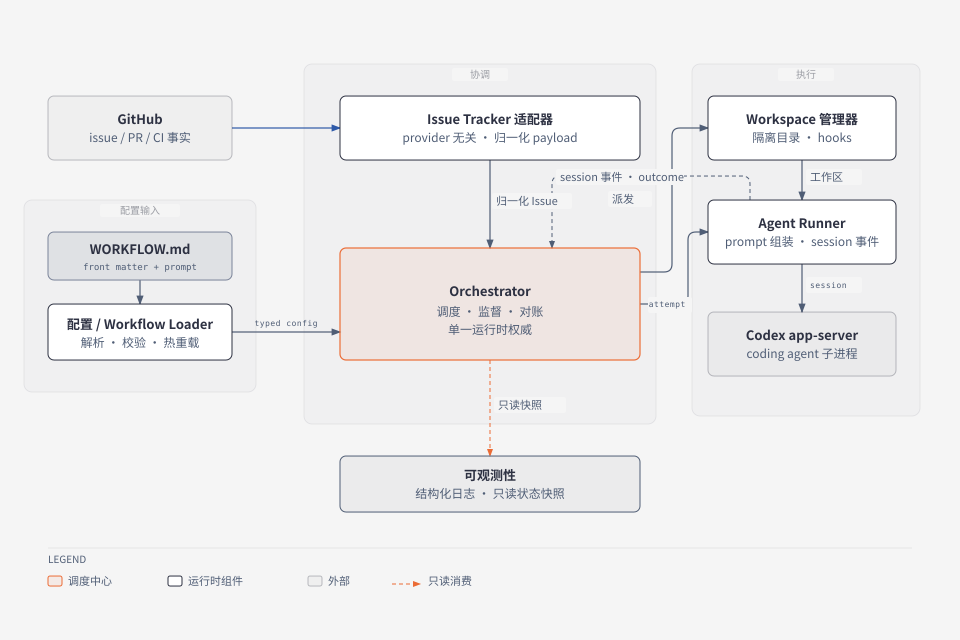
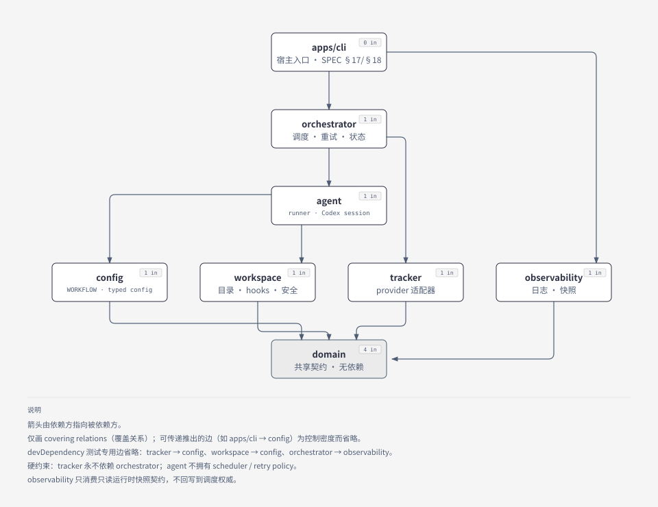

# 架构

> 本文件只记录**稳定架构**：产品模型、组件职责、依赖方向与进程 / lifecycle 契约。当前实现状态、里程碑、deferred 与 next work 只在 [status.md](status.md) 维护；SPEC 逐项能力与验收证据见 [conformance.md](conformance.md)；装配与测试入口见 [testing.md](testing.md)。

## 产品模型

symphony-ts 是 [OpenAI Symphony](https://github.com/openai/symphony) 官方 `SPEC.md` 的 TypeScript 实现（baseline 固定与升级规则见 [upstream.md](upstream.md)）。Symphony 是一个**长运行的 orchestrator**：从 issue tracker 读取工作，为每个 issue 建立隔离 workspace，运行 coding agent，并负责 retry / reconciliation / observability。

运行模型（SPEC §3）：

```
WORKFLOW.md → Config → Issue Tracker → Orchestrator → Workspace → Agent Runner → Observability
```

（上面的顺序是 SPEC §3 的组件列举，不是一条单向数据管道；运行期以 `Orchestrator` 为中心协作，见下方架构图。）

1. **Workflow Loader** 解析仓库内的 `WORKFLOW.md`（YAML front matter + 原始 prompt 正文）；
2. **Config Layer** 产出 typed config：默认值合并、`$VAR` 环境解析、tilde 展开 / 相对路径规范化、无效配置类型化报错并安全回退；
3. **Issue Tracker Adapter** 按配置轮询符合条件的工单，把 provider payload 归一化为 Issue（保留 provider keys）；
4. **Orchestrator** 维护单一权威 runtime state：claim 集合、并发上限、dispatch 排序、retry / backoff 队列与 reconciliation；
5. **Workspace Manager** 为每个 issue provisioning 隔离目录（id 净化、防碰撞），校验路径 containment，执行生命周期脚本；
6. **Agent Runner** 组装注入 issue 上下文的 prompt，启动 coding agent 子进程（如 Codex app-server），向上转发 live session 事件（token / turn / PID）；
7. **Logging / Status Surface** 输出结构化日志（保留关键标识符），并以只读 snapshot 提供面向操作者的状态出口。



上图是运行模型的权威可视化：`Orchestrator` 是中心 hub，`WORKFLOW.md` 经 Config / Workflow Loader 变成 typed config 进入调度；Issue Tracker Adapter 只做 provider 归一化，GitHub 是其外部持久事实来源；Workspace Manager 与 Agent Runner（驱动 Codex app-server 子进程）由 orchestrator 派发，Agent Runner 再通过 session 事件与 attempt outcome 向 orchestrator 回传监督事实；Observability 只消费只读 snapshot。英文版见 [runtime-architecture（English）](diagrams/runtime-architecture.svg)；可编辑源与再生成步骤见 [docs/diagrams/](diagrams/README.md)。

## Workspace 职责与依赖方向（SPEC §3 映射）

| 包 | SPEC §3 组件 | SPEC sections | 职责 | 依赖 |
|---|---|---|---|---|
| `packages/domain` | —（共享契约） | §4 | Issue、WorkflowDefinition、ServiceConfig、Workspace、RunAttempt、LiveSession、RetryEntry、OrchestratorRuntimeState 等类型与纯逻辑的唯一权威 | 无 |
| `packages/config` | Workflow Loader + Config Layer | §5、§6 | `WORKFLOW.md` 发现 / 解析、front matter schema、typed 校验、env / path resolution、模板渲染、热重载回退 | domain |
| `packages/tracker` | Issue Tracker Adapter | §11 | provider 无关的读取接口、认证、payload → Issue 归一化 | domain（`config` 仅为 devDependency，见下） |
| `packages/workspace` | Workspace Manager | §9 | 隔离目录 provisioning、containment 校验、lifecycle hooks | domain（`config` 仅为 devDependency，见下） |
| `packages/agent` | Agent Runner | §10、§12 | prompt / 上下文组装、coding agent 子进程控制、session 事件流 | domain, config, workspace |
| `packages/orchestrator` | Orchestrator | §7、§8、§14、§16 | 状态机、polling / scheduling / reconciliation、retry / backoff、单一权威 runtime state | domain, config, tracker, workspace, agent |
| `packages/observability` | Logging + Status Surface | §13 | 结构化日志、只读 runtime snapshot、状态出口 | domain |
| `apps/cli` | —（宿主入口） | §17、§18 | CLI / 进程生命周期、组件装配 | domain, config, tracker, workspace, agent, orchestrator, observability |

依赖只允许自上表"依赖"列的方向流动；新增跨包依赖前先读 [AGENTS.md](../AGENTS.md) 的扩展点表。表中的"依赖"列指**运行期**（`dependencies`）方向；为了证明跨包接线而引入的 **devDependency / 测试专用**边不视为违反方向流动，但必须在表里显式标注。当前两条例外：`packages/tracker` 与 `packages/workspace` 各以 devDependency 引用 `@symphony/config`（各自仅 `src/config-integration.test.ts` 使用），用来证明扩展点或 typed 契约两侧真的对得上——`@symphony/config` 侧不引用它们，运行期方向仍是 `tracker → domain`、`workspace → domain`。两条硬约束：

1. **tracker 永不 import orchestrator**——轮询节奏 / claim / 调度属 coordination 层；
2. **agent runner 不拥有 scheduler / retry policy**——coordination 只由 orchestrator 拥有。



依赖图只画 covering relations（省略可由传递推出的边以控制密度）：箭头指向被依赖方，`apps/cli` 位于顶端、`@symphony/domain` 位于底端并汇聚全部包。tracker 不依赖 orchestrator、agent 不拥有 scheduler / retry、observability 只消费只读 snapshot 都能由图形结构直接读出；devDependency 测试边（tracker → config、workspace → config、orchestrator → observability）不计入生产依赖，因此不出现在图中。英文版见 [package-dependencies（English）](diagrams/package-dependencies.svg)。

`observability` 对 orchestrator state 的消费是**只读 snapshot 契约**（类型归属 domain），不回写、不参与调度。

## 历史：M0 协议栈 scaffold 已删除

M0 / M0.5 曾把 Symphony 理解为 `sym/0` 消息协议 + protobuf wire + 可靠 UDP + gateway + relay + 插件协议栈，与官方 SPEC 无对应关系；M0.6 已整体删除（sym / proto / transport / gateway / plugins / relay / ctl / examples），历史仅存于 Git。决策与被否备选见 [align-with-upstream-spec note](../notes/accepted/architecture/2026-09-26-align-with-upstream-spec.md)。

## 只读 snapshot

`@symphony/domain` 是 snapshot/view/clock/result 共享类型权威，`@symphony/observability` 从 authority 当前 state 同步投影。无第二份 scheduler/config authority；snapshot 不作为 scheduling 输入。host 注入与 authority 同源的 monotonic clock 及 wall clock，读 snapshot 不入账 tokens/duration。retry URL 仅为可选 metadata，重排更新与显式 null 语义见 [决策 Note](../notes/accepted/architecture/2026-10-03-observability-snapshot.md)。orchestrator → observability 仅 devDependency 测试边，生产依赖方向不变。logger/observers 独立消费提交点事实，不从 snapshot diff 推断事件；生产 CLI host 通过相同 ports 装配；HTTP 属 optional extension。

## Executable lifecycle

`args.ts` 解析 argv/path，`host.ts` 管理进程无关资源，`lifecycle.ts` 的 `runCli` 安装本次 signal/fatal handlers 并返回退出码，`bin.ts` 只设置 `process.exitCode`。顺序固定为 argv → path → initial config/tracker preflight → runtime/observability 装配 → SIGINT/SIGTERM handlers → watcher monitoring → loop。config 的 `autoStart: false` 延迟 interval；其他调用者默认仍自动监听。

host stop 同步关闭 EffectiveRuntime 提交与 watcher，再调用既有 loop.stop 的同步前缀关闭 authority 调度；等待 startup/tick/worker/cleanup 后输出最终 lifecycle 日志并关闭 logger，shell 最后移除本次 handlers。重复信号与 stop 共享收口 promise；失败优先；信号取消正常启动不会记录 startup completed。timer 迟到回调、closed reload/preflight 均不复活 runtime。原有 scheduler、attempt/root 绑定、session.stop → after_run 与 transport TERM→KILL 保持唯一实现。

文件、用例名和命令见 [conformance.md 的 Core 证据索引](conformance.md#m65-core-证据索引)，设计取舍见 [lifecycle Note](../notes/accepted/architecture/2026-10-03-cli-process-lifecycle.md)。
