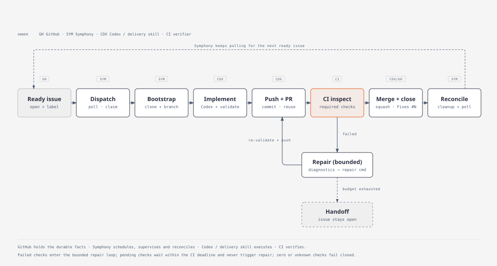
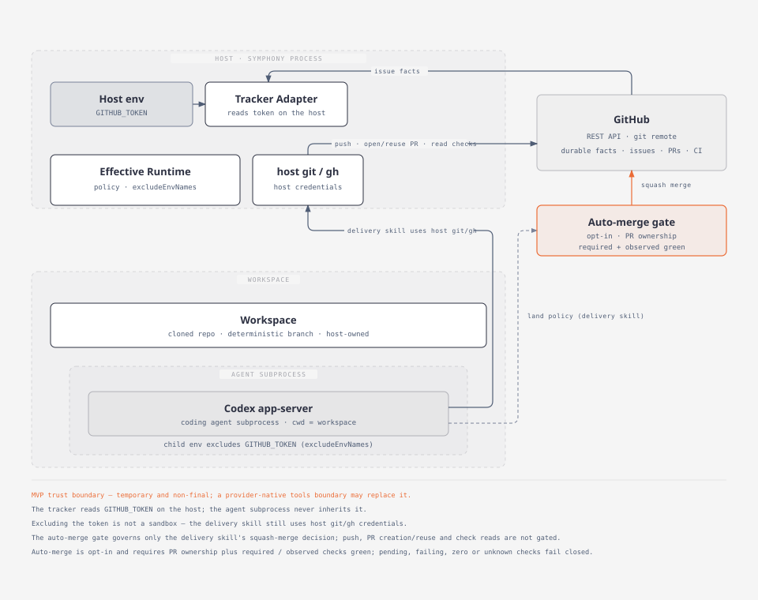

# GitHub delivery loop

This document describes the closed-loop GitHub delivery workflow introduced by
the GitHub Delivery MVP (NEST-89 / #78). It explains who owns which step, what
GitHub facts drive the loop, how the loop starts and stops, and where the MVP
trust boundary sits. The runnable profile is
[examples/github-delivery/WORKFLOW.md](../examples/github-delivery/WORKFLOW.md);
the copy procedure is in [examples/github-delivery/README.md](../examples/github-delivery/README.md).

## Design goals

- **GitHub is the durable work and delivery truth.** Issue state, pull-request
  state, and check state are the facts the loop consumes.
- **Symphony is scheduler / supervisor / reconciler.** It discovers work,
  provisions a workspace, launches and supervises the agent, retries, reconciles,
  and cleans up. It does not embed a pull-request or CI state machine.
- **Codex is the execution agent.** It implements, validates, and drives delivery
  through the delivery skill.
- **CI is the automated verifier.** The loop lands only when every required check
  is green.

The runtime responsibilities already exist in the packages; this workflow adds no
new orchestrator state or second state machine.

## Responsibility split

| Step | Owner | Notes |
|---|---|---|
| Discover dispatchable issues | Symphony (tracker polling) | `open` + `required_labels` (`symphony-ready`) |
| Provision per-issue workspace | Symphony (`@symphony/workspace` hook) | `after_create` runs `symphony repo-bootstrap` |
| Implement + run project validation | Codex | Local gate such as `npm run gate` |
| Commit / push / create-or-reuse PR / read CI / repair / land | Codex (delivery skill) | `symphony delivery-skill run ... --repair-cmd ... --opt-in` |
| Auto squash-merge decision | Delivery skill, using `@symphony/domain` policy | Opt-in only; ownership-checked |
| Issue closed | GitHub | PR body `Fixes #N` closes the issue on merge |
| Observe terminal issue + cleanup | Symphony (tracker refresh + reconciliation) | Existing path; no new state machine |

Facts that always come from GitHub: whether the issue is `open`/`closed`; whether
a pull request already exists, is open, mergeable, and whether its checks are
green; whether the issue was closed by a merge.

## Start

1. Build the CLI and put it on `PATH` (`npm ci && npm run build`; the binary
   is `apps/cli/dist/bin/symphony.js`).
2. Copy the reference profile into the target repository and fill in the
   repo-specific values (see the [example README](../examples/github-delivery/README.md)).
3. Export `GITHUB_TOKEN`, ensure `git` credentials and an authenticated `gh` are
   available, and make sure `codex app-server` can start.
4. Start the host:

   ```sh
   symphony /path/to/WORKFLOW.md
   ```

An `open` issue carrying `symphony-ready` is then dispatched on the next poll.

## Run

```text
open issue + symphony-ready
  → Symphony polling + dispatch
  → workspace bootstrap (clone + deterministic symphony/<workspaceKey> branch)
  → Codex implement + validate
  → commit + push
  → create or reuse PR (ownership marker + Fixes #N)
  → CI inspect
       ├─ failed → run --repair-cmd → re-validate → push again (bounded)
       └─ green + mergeable
  → squash merge (opt-in only)
  → Fixes #N closes the issue
  → Symphony tracker refresh sees closed
  → terminal reconciliation + workspace cleanup
```

The PR body uses `Fixes #N`, so GitHub closes the issue automatically on merge.
Symphony then sees the terminal state through its normal tracker refresh and
releases the workspace — no extra label is involved.



The diagram is the canonical visual for the path above. GitHub holds the durable
work / delivery facts, Symphony schedules, supervises and reconciles, the Codex
delivery skill implements and drives delivery, and CI verifies. Landing requires
CI green and a mergeable PR plus explicit opt-in and PR ownership; a failing
check enters the bounded repair loop, while a pending check waits within the CI
deadline. When the repair budget, the CI deadline or merge safety is exhausted —
or delivery cannot otherwise complete safely — the loop exits through the handoff
path instead of retrying forever. A Chinese-primary version is available at
[github-delivery-loop（中文）](diagrams/zh/github-delivery-loop.svg). Editable
source and regeneration steps: [docs/diagrams/](diagrams/README.md).

## Stop and exit paths

The loop has exactly three outcomes:

1. **Success** — the PR is merged and the issue is `closed`; Symphony observes the
   terminal state and cleans up the workspace. No human merge step.
2. **Retryable failure** — a transient or technical failure (CI failure within
   budget, push error, temporary provider error). The delivery skill repairs
   within a bounded budget (default `--max-repairs 3`, `--max-wait 300`); the
   existing Symphony retry policy handles worker-level failures. A resumed run
   continues from GitHub's current facts rather than a remembered session.
3. **Product blocker / handoff** — the requirements are ambiguous, the change is
   destructive, the change cannot be merged safely, or a budget (repair attempts,
   CI wait) is exhausted. The skill must not guess: it keeps the issue open,
   removes `symphony-ready` to stop further dispatch, and posts an
   operator-visible handoff report.

### Repairing a CI failure

The delivery skill does not guess its way through a failing build. On a CI
failure it fetches the failure diagnostics, runs the configured repair entry
(`--repair-cmd`, with the logs in `SYMPHONY_CI_FAILURE_DIAGNOSTICS`), re-runs
`--validate`, commits and pushes the new changes, and only then re-checks CI.
This repeats up to `--max-repairs` times. A repair command that exits non-zero,
produces no working-tree changes, or pushes no new SHA ends the loop with a
handoff instead of looping forever. The reference profile supplies the repair
entry through `$SYMPHONY_DELIVERY_REPAIR_CMD` (default `npm run ci:fix`), so a
repository that wants unattended repair must provide that command.

### Recovering from a handoff

A handoff is explicit, not a dead end:

1. Fix the root cause the handoff describes.
2. Re-add the `symphony-ready` label so Symphony dispatches the issue again:

   ```sh
   gh issue edit <number> --repo <owner/repo> --add-label symphony-ready
   ```

3. The delivery command detects the persisted paused state
   (`<workspace>/.symphony/delivery-state.json` with `"isPaused": true`) and passes
   `--resume` automatically, so the same workspace continues rather than refusing
   to run.

`--resume` deliberately preserves the already-spent repair count and the absolute
CI-wait deadline — it does not grant a new budget, so repeatedly resuming cannot
extend an exhausted budget. Decide whether a new budget round is needed from the
**persisted budget and deadline at recovery time, not only from the original
handoff reason**: even a handoff caused by `unmergeable` or a
permission/infrastructure blocker can outlast the deadline while a human resolves
it, and because `--resume` keeps that deadline the next run would time out
immediately. Whenever the persisted repair count is already at its maximum or the
absolute deadline has passed, an operator must explicitly start a new budget round
by clearing the persisted state before re-adding the label:

```sh
rm <workspace>/.symphony/delivery-state.json
```

Treat that deletion as an operator action: it is the authorization for a fresh,
bounded attempt, not something the agent should do on its own.

Graceful host shutdown uses `SIGINT` / `SIGTERM`; the host closes workers and
resources before exiting.

## Safety: non-Symphony work is never auto-merged

Four layers keep automatic landing scoped to opt-in Symphony work:

1. **Dispatch gate** — `tracker.required_labels: [symphony-ready]`. Only labeled
   issues are scheduled, so unmanaged work never enters the loop.
2. **Explicit opt-in** — the prompt calls `symphony delivery-skill run ... --opt-in`;
   without it the skill stops after CI is green and never merges.
3. **PR ownership** — the PR carries a `symphony-delivery-marker` and must belong
   to the current issue/workspace; foreign PRs, ambiguous candidates, and
   closed-unmerged PRs are rejected.
4. **Check policy** — landing requires the PR to be open, mergeable, and every
   required and observed check to be successful. Pending, failing, zero, or
   unknown checks fail closed.

There is no "scan open PRs and merge them" mode.

## Credential / trust boundary (MVP)

The MVP lets the delivery skill use the host's `git` and authenticated `gh` to
perform delivery. This is an explicit, temporary trust boundary:

- The tracker reads `GITHUB_TOKEN` on the host; the agent subprocess never
  inherits it (`excludeEnvNames`).
- `git push` and `gh` calls rely on host-provided credentials (for example
  `gh auth setup-git`), not on a token placed in the workspace.
- The delivery runner redacts classic/fine-grained PATs, bearer headers, and
  credential-bearing URLs from everything it prints.



The diagram shows the same boundary: the tracker reads `GITHUB_TOKEN` on the
host; the agent subprocess never inherits it (`excludeEnvNames`); the delivery
skill still reaches GitHub through host-provided `git` and authenticated `gh` for
push, PR creation/reuse and check reads. The opt-in / ownership / check-policy
gate governs only the delivery skill's squash-merge decision — it is not a
credential layer in front of every GitHub call. Excluding the tracker token does
not sandbox the agent from host credentials, and this is the current
temporary MVP boundary rather than the final provider-native model. A
Chinese-primary version is available at
[delivery-trust-boundary（中文）](diagrams/zh/delivery-trust-boundary.svg).

The loop is now proven by the end-to-end dogfood (#83 / PR #88). A provider-native
tools boundary may replace this temporary boundary in the future; do not treat the
MVP boundary as the final security model.

## Recommended initial values

| Setting | Initial value | Where |
|---|---|---|
| Dispatch label | `symphony-ready` | `tracker.required_labels` |
| Poll interval | `30000` ms | `polling.interval_ms` |
| Concurrent agents | `1` | `agent.max_concurrent_agents` |
| Turns per session | `20` | `agent.max_turns` |
| Hook timeout | `120000` ms | `hooks.timeout_ms` |
| CI repairs | `3` | `--max-repairs` |
| CI wait | `300` s | `--max-wait` |

## Configuration reference

The profile's front matter is the standard Symphony `WORKFLOW.md` service config.
Field semantics and defaults are owned by [`@symphony/config`](../packages/config/README.md)
and the GitHub tracker keys by [`@symphony/tracker`](../packages/tracker/README.md).
The delivery protocol itself is documented in the
[GitHub delivery skill](../skills/github-delivery/SKILL.md) and the
[CLI reference](../apps/cli/README.md).

## Not in scope

This profile does not add dashboards, HTTP surfaces, SSH workers, multiple
providers, durable scheduler state, a review-approval gate, or a PR/CI state
machine inside the orchestrator. The end-to-end real GitHub + real Codex dogfood
is implemented as an opt-in harness; see
[docs/github-delivery-dogfood.md](github-delivery-dogfood.md) and the target
[template](../examples/github-delivery-dogfood/README.md).
